<div align="center">


<br>


<br><br>

# 🦊 喫音

### `C++` ・ `Reverse Engineering` ・ `Game Modding`

<br>

<a href="https://github.com/Yuki0320-lol">

</a>

<a href="https://www.youtube.com/@vrc_kitunechan">

</a>

</div>

---

## 👋 喫音について

こんにちは、**喫音**です。

ゲーム改造、リバースエンジニアリング、低レベルプログラミングなどを中心に色々やっています。

```text
名前         喫音 / Kitune

好きなもの   COD / Minecraft / Apex / Roblox / 雑談 / 動画編集

やってる事
             ├─ ゲーム改造
             ├─ リバースエンジニアリング
             ├─ クライアント開発
             └─ ツール制作

環境         Windows 11

現在         特に何も作らずゲーム三昧
```

---

## ⚡ Tech Stack

<div align="center">


<br><br>


</div>

---

## 🎮 What I Do

<table align="center">
<tr>

<td align="center" width="33%">

### 🔬 Reverse Engineering

IDA / Ghidra を使った
ゲームバイナリの解析や
PowerPC周辺の研究

</td>

<td align="center" width="33%">

### 🧩 Game Modding

Minecraft Wii U / PS3 / PSP など
ゲームの改造や
Mod開発

</td>

<td align="center" width="33%">

### 🛠️ Development

C++ / Python を中心に
ツールやプラグインなどを
気ままに開発

</td>

</tr>
</table>

---

# 📊 GitHub Statistics

<div align="center">

<a href="https://github.com/Yuki0320-lol">

</a>

<a href="https://github.com/Yuki0320-lol">

</a>

<br><br>


</div>

---

## 📈 Activity

<div align="center">


</div>

---

## 🧪 Currently Working On

<table>
<tr>

<td width="50%">

### ⛏️ Minecraft Wii U

* Custom Client
* Plugins
* Rendering
* Game Modding
* PowerPC Analysis

</td>

<td width="50%">

### 🔍 Reverse Engineering

* IDA
* Ghidra
* Binary Analysis
* PowerPC
* Memory / Functions

</td>

</tr>
</table>

---

## 📺 YouTube

<div align="center">

<table border="2" cellpadding="6" cellspacing="0">
<tr>
<td>
<a href="https://www.youtube.com/@vrc_kitunechan">

</a>
</td>
</tr>
</table>

<br>

<a href="https://www.youtube.com/@vrc_kitunechan">

</a>

</div>

---

## 🌐 Links

<div align="center">

<a href="https://github.com/Yuki0320-lol">

</a>

<a href="https://www.youtube.com/@vrc_kitunechan">

</a>

<a href="https://guns.lol/kitune">

</a>

</div>

---

<div align="center">

<br>


</div>
